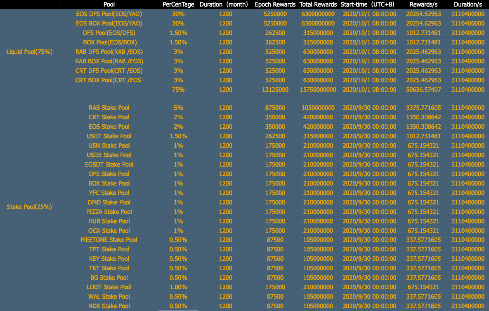

# yao.finance

## 介紹
- 玉兔搗藥, 致敬所有EOS上的項目方。挖礦持續100年,100年後希望家人們都還在！
- 一池: 0.1%手續費, 剩下資金原路退回;二池: 只需映射LP Tokens, 無需額外轉幣, 私鑰丟eosio.null, 100%安全
- 藥（YAO）將以YFI的形式發放,持續一百年：沒有創始人，沒有投資人，沒有預挖，沒有增發，採用玉兔搗藥這個古老的傳說，致敬開創TVI模式的Rabbits.finance團隊！ 

## YAO 代幣分發規則

- 代幣符號: YAO
- 代幣總量: 21000000000 YAO
- 代幣合約: [yaocoretoken](https://bloks.io/account/yaocoretoken)
- 礦池合約: [yaostakecore](https://bloks.io/account/yaostakecore)



## 合約安全
YAO代幣合約以及挖礦合約私鑰已交給系統黑洞賬戶: eosio.null, 不存在修改合約增發代幣風險以及用戶本金損失風險。

### 如何驗證合約

- EOSIO Version: 2.0.5
- EOS.CDT Version: 1.7.0

```
cleos get code yaocoretoken > yaocoretoken.hash
cleos get code yaostakecore > yaostakecore.hash
```

從源代碼構建:
```
./build.sh
```

比較哈希:
- 比較 `shasum -a 256 build/contracts/yao.token/yao.token.wasm` 和 `yaocoretoken.hash`
- 比較 `shasum -a 256 build/contracts/yaostake/yaostake.wasm` 和 `yaostakecore.hash`
- 令牌哈希: 837bd71762daddb2b289c976c4e9b8d9fb4d4f738442190688f065dcd0cc66f6
- 池哈希: d8cb7834d14abdf683fc55ed09e0adcfa17ffeaaf9c31df3838a94b4e7de267e
